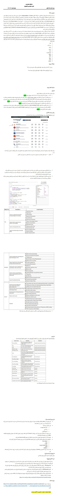

# **⛏ Data Minning StackOverflow Website Project | پروژه داده کاوی وب‌سایت StackOverflow**

**A university project related to data mining lesson on StackOverflow website data with Python language.**

**یک پروژه دانشگاهی مربوط به درس داده کاوی بر روی داده‌های وب‌سایت StackOverflow با زبان پایتون.**

# 💬 **نکات پروژه**

* گزارش‌ها، عکس‌ها و خروجی‌های هر فاز در دایرکتوری Report آن قرار دارند.
* برای اجرا برنامه، به پایتون بالاتر از نسخه 3.6 نیاز دارید.
* کتابخانه‌های مورد نیاز در فایل requirements.txt قرار دارند.
* برای دسترسی به همه‌ی پروژه‌های دانشگاهی من، به این لینک مراجعه کنید:

👈🏻 **[پروژه‌های دانشگاهی من](https://github.com/bestmahdi2/Uni__Bachelors_SKU_Path)**

# 📝 **توضیحات پروژه**

